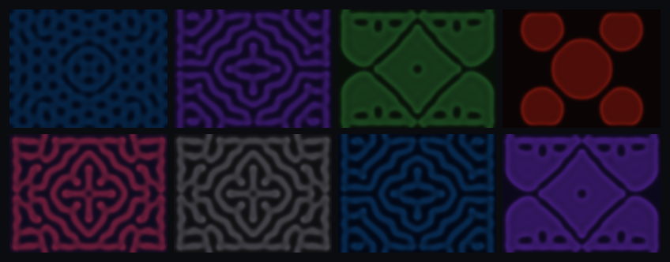

# Petri 🧫

**A breedable garden of living patterns.**



### ▶ [Play it live →](https://bernardogv.github.io/petri/)

Petri treats the parameter-space of a [reaction-diffusion](https://en.wikipedia.org/wiki/Reaction%E2%80%93diffusion_system)
simulation as a **genome you can breed**. Each specimen is a handful of numbers
that grow — live, on a canvas — into a unique Turing pattern: coral, mazes,
spots, solitons, dividing cells. Cross two specimens and the offspring inherits
a genetic crossover of their genes, plus mutation, and grows something new.

It runs entirely in your browser. No build step, no dependencies, no server
required — just open the file.

> In 1952, Alan Turing wrote his only biology paper, proposing that the spots on
> a leopard and the stripes on a fish emerge from two chemicals reacting and
> diffusing. Petri makes that model *breedable*: since reaction-diffusion is
> itself a theory of how biological form is inherited and varies, crossing two
> genomes is not a gimmick — it's apt.

## Try it

- **In your browser:** [bernardogv.github.io/petri](https://bernardogv.github.io/petri/)
- **Offline:** download [`petri.html`](petri.html) and double-click it. It's a
  single self-contained file with no dependencies.
- **From source:**
  ```sh
  npm run serve     # serves index.html at http://localhost:8731
  ```

## What you can do

- **Spawn** wild specimens — each grows into a living pattern across 6 palettes.
- **Breed** any two — offspring genome = crossover + mutation of its parents;
  generation and full lineage are tracked.
- **Share** — every specimen is a deterministic `PETRI-XXXX-XXXX` seed code.
  *Any* text grows a creature too ("ocean bloom" → a purple soliton flower).
- **Perturb** — click the dish to inject a disturbance and watch it heal.
- Your garden persists in the browser across reloads.

## How it works

| Layer | What it does |
|---|---|
| **Simulation** | Gray-Scott reaction-diffusion on a toroidal grid, integrated each frame. |
| **Genome** | `{ feed, kill, dA, dB, seedKind, palette }` ↔ a shareable base32 seed code. |
| **Breeding** | Per-gene crossover from a parent, then bounded Gaussian mutation, seeded for reproducibility. |
| **Garden** | Collection, lineage (family tree), and `localStorage` persistence. |

A genome grows by seeding the grid and stepping the simulation. The interesting
constraint discovered while building this: **most of the feed/kill space is
non-viable**, and patterns only ignite from a *localized* seed that creates a
gradient — uniform noise homogenizes into nothing. So spawns and text-imports
are biased toward curated, empirically-verified "wild species" anchors, and
breeding explores the space between them.

## Project structure

```
src/
  rng.js       seedable deterministic PRNG
  sim.js       Gray-Scott reaction-diffusion engine
  genome.js    genome type, seed-code codec, crossover + mutation
  palette.js   color palettes (concentration → RGB)
  garden.js    collection, lineage, persistence
  render.js    canvas rendering
  main.js      UI wiring + animation loop
tests/         32 unit tests (node --test)
index.html     dev entry (loads src/ as ES modules)
build.mjs      inlines everything into the single-file petri.html
```

## Development

```sh
npm test       # run the unit tests (pure logic: sim, genome, breeding, codec)
npm run build  # regenerate petri.html from src/ + index.html
npm run serve  # local static server on :8731
```

The core logic is pure and unit-tested headless; the visual layer is verified in
a real browser.

## About

Petri was conceived and built end-to-end by [Claude Code](https://www.anthropic.com/claude-code)
as an experiment: can an AI have an original idea and carry it all the way to a
finished, working artifact? This is the result.

## License

MIT — see [LICENSE](LICENSE).
